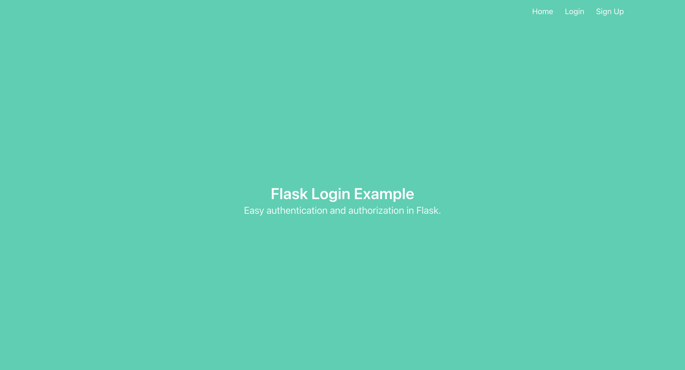

# COMP3310 Week 10

This workshop uses similar code to the Week8 workshop, but now you will be integrating tests into the framework.
Make sure you follow the instructions for Week 8 (below this) to get the initial packages installed (If you completed the Week 8 task then just follow the next steps).

## WEEK 10 INSTRUCTIONS - follow these after you have installed the packages for the Week 8 task (see further below).

For this task you will should have pip and python3 installed already. Run the following:

- pip install pytest pytest-cov

### Initialising the database

You should first initialise the database as follows:
- python initialise_db.py

This should create an sqlite database under the instance directory. You can view the contents of the database using the sqlite command line interface as follows:

sqlite3 instance/db.sqlite
> .schema  
CREATE TABLE user (
	id INTEGER NOT NULL, 
	email VARCHAR(100), 
	password VARCHAR(100), 
	name VARCHAR(1000), 
	PRIMARY KEY (id), 
	UNIQUE (email)
);
> select * from user;
>

You should see that there are no users in the database. 

### Run the website

You can run the website by typing:

- python run.py

(If you are using a Mac you may need to type python3 run.py).

You can now browse to the url http://localhost:8001/ and you should see the home page for the website.

## WEEK 8 INSTRUCTIONS - follow these first if you did not complete the Week 8 task.

For this task you will need to have the following installed:

- python3
- pip

If you have a Windows 10 machine, you can follow instructions on installing Python here: https://www.digitalocean.com/community/tutorials/install-python-windows-10 

Pip is the package manager for Python.  You can install the remaining packages required for this task using pip. You will need to run the following:

- pip install flask flask-sqlalchemy flask-login

(NOTE: If you are using a Mac you may need to use the command pip3 instead of pip to ensure you are installing packages for python3)

You should have at least the following versions installed: 
- Python             3.9.6
- Flask              2.2.3
- Flask-Login        0.6.2
- Flask-SQLAlchemy   3.0.3

You will also need sqlite installed for the database backend.

